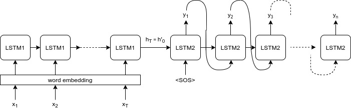
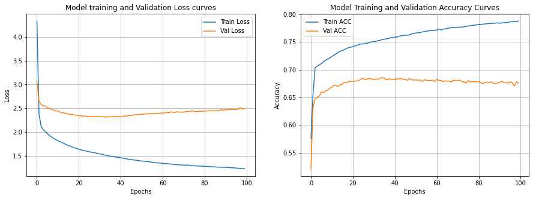

# Seq2Seq (English to Spanish)

In Seq2Seq, the encoder LSTM is passed through input sequence till we get final state of encoder LSTM which is called "thoughvector". This thoughtvector is feeded into decoder LSTM which is used to generate translation.

I have used "Teacher Forcing" where instead of using last word of decoder output as next input to decoder, we used actual word which should be last decoder output.

## Training

Model was trained for 100 epochs using RMSprop optimizer.

[View Notebook in Colab](https://colab.research.google.com/drive/1PLyh0J_NJ1suKXnoqIXp_iqgurqtKOqp)

### Contribution

[Aditya Jain](https://adityajain.me)