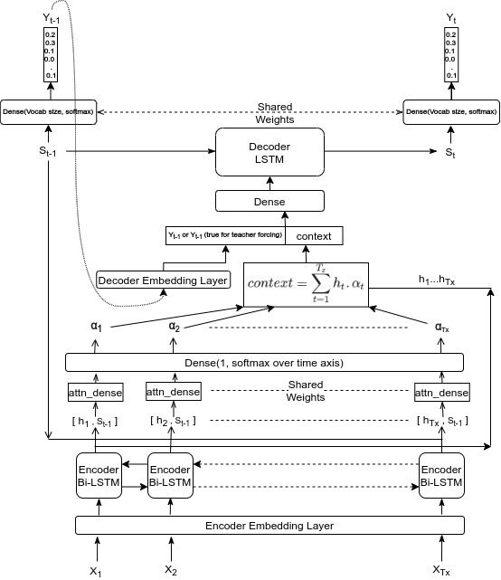
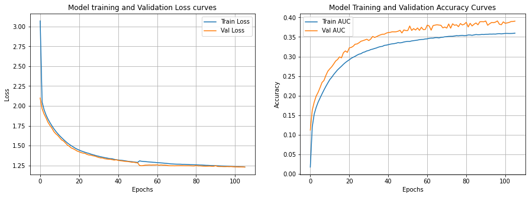
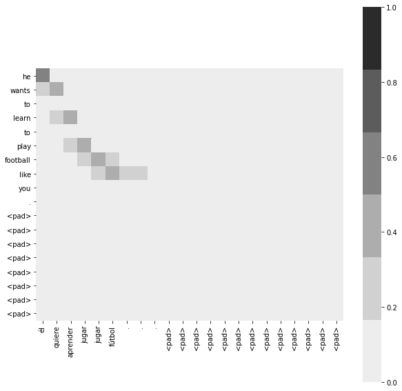
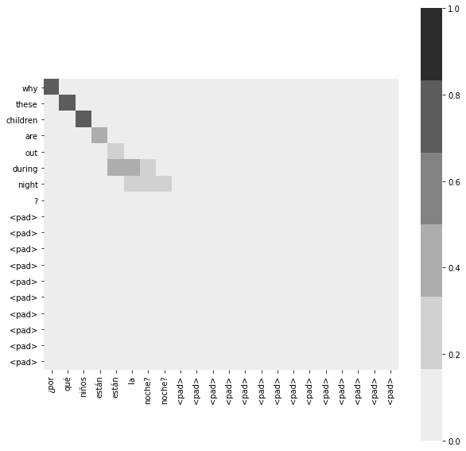

### Seq2Seq with Attention

We have seen how seq2seq tries to put all information that is collected by encoder into one thoughvector. Whether it is a 2 word sentence or 30 word sentence the information is encapsulated in one thoughtvector array. Also, suppose we have a long sentence and some important information was there in beginning of sentence, that information will most probably be lost till the end. 

This type of situation also occured previously during classification task, instead of applying softmax on last hidden state, we have done MaxPooling on all hidden state, so that the we can capture important information from all hidden states.

Similar principle is used in seq2seq problems with the help of attention mechanism. Deep learning models are probabilistic models, so we will use weights (called alpha) to give importance to each Tx hidden state of encoder for that particular time step in decoding sequence. Previous hidden state of decoder is concatenated with each hidden state and passed through a small network with a single neuron at end. Then softmax is applied on time axis, along hidden states, so we will get Tx probabilities which will sum to 1. Now multiply each probability with corresponding hidden state and sum them to get attention. Of course its shape will same as encoder hidden state.

We can this all hidden states are features and we are using softmax over time to weight them, which will be later feeded into another LSTM.

We can also use **Teacher Forcing** by concatenating previous actual word's embedding with the attention and give it as input to decoder lstm cell. Also, variations like a dense layer before that is also possible. During testing use previous decoded word embedding as an input.

The detailed architecture is show below.

## Training

Model was trained for around 100 epochs using rmsprop optimizer.

[View Notebook in Colab](https://colab.research.google.com/drive/1RUTtjvfDd-MP1ZqfFM9H_kown90K62is)

## Visualizing Attention

|  He wants to learn to play football like you. 	|  Why these children are out during night?	|
|---	|---	|
|   	|   	|

## Contributors

* [Aditya Jain](https://adityajain.me)