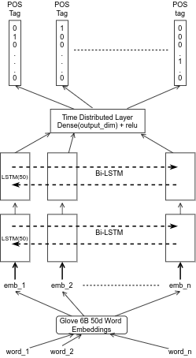
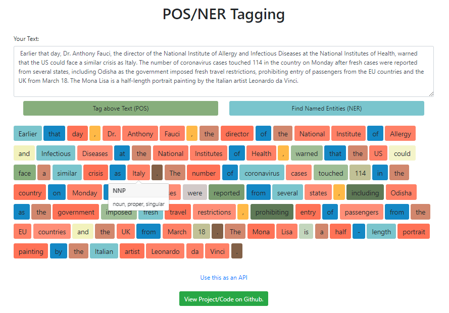
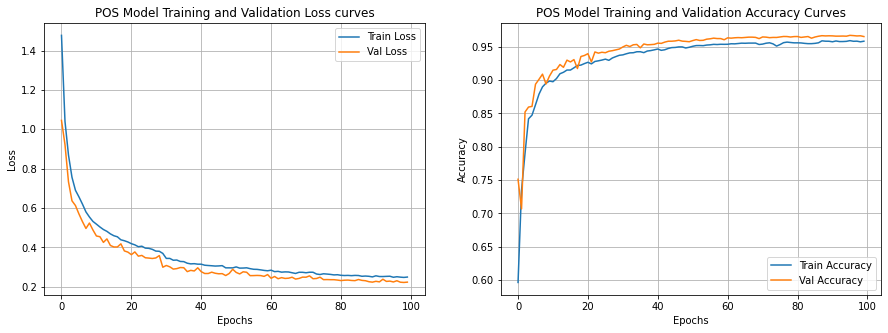

# Named Entity Recognition

Part of Speech tagging is extracting tags of words and labeling them by their part of speech.

Here, I have used a 2 Bidirectional LSTM layers which are feeded with glove word embeddings, and then the return sequence is passed to Time Distributed Layer to get output. Detailed architecture is described below.

## Reusable snippets

1. Getting Glove Embedding Matrix
2. Keras Train on Batch and validate on whole

## Web App

I built a web app to tag named entity in sentences, which you can run directly run on docker machine using following command

    docker container run -p 80:80 adityajn105/ner_pos_tagging_app:latest
    
Use port 80 of you host machine to access app.

### Training Progress

I have used categorical crossentropy loss with RMSprop optimizer and trained for 100 epochs after which I achieved around 95.5% Accuracy on validation dataset.

### Contribution

[Aditya Jain](https://adityajain.me)