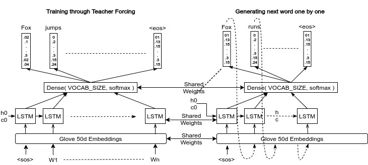

## Poem Generator

Here, I have used a LSTM layer and feeded it with glove word embeddings to learn poems. This is done by "Teacher Forcing" where during learning instead of feeding previously generated word in LSTM, we will feed the actual word. But during testing, it was done one word at a time.

## Reusable snippets

1. Lightweight Machine Translation Decoder

### Contribution

[Aditya Jain](https://adityajain.me)