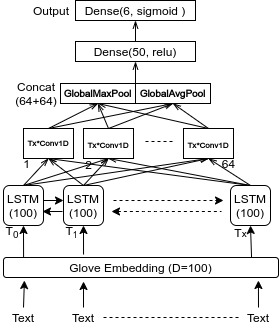
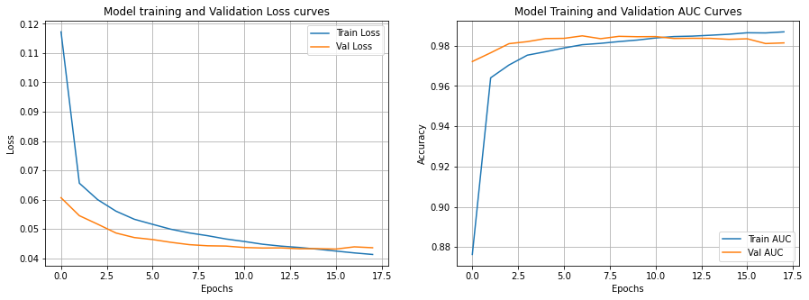

# Toxic Comment Classification

Here, I have used a Bi-LSTM + Conv1D layers which are feeded with glove word embeddings. Detailed architecture is given below.

## Reusable snippets

1. Getting Glove Embedding Matrix
2. Keras Train on Batch and validate on Batch with Early Stopping.
3. train and test Batch Generator

### Training Progress

I have used binary crossentropy loss with Adam optimizer and trained for 17 epochs after which I achieved around 0.97743 AUC on validation dataset.

### Contribution

[Aditya Jain](https://adityajain.me)